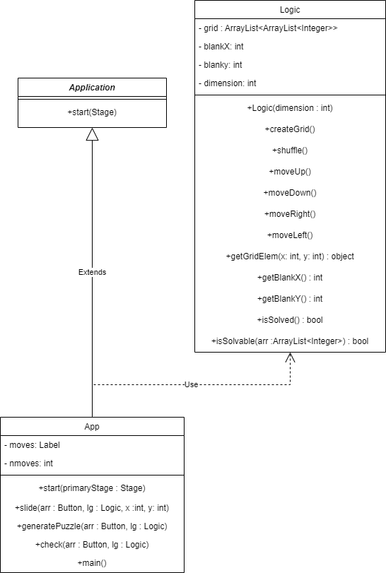

# 15 Puzzle Kelompok 4

This repository is a final project (Java GUI) from Object-Oriented Programming Class, Teknik Informatika Universitas Padjadjaran. 

[Challenge Guidelines](challenge-guideline.md)

Projek ini adalah projek dari mata kuliah praktikum PBO yang bertujuan untuk membuat program aplikasi permainan 15 Puzzle dengan menggunakan teknik Pemrograman Berbasis Objek berbasis bahasa pemrograman JAVA

## Credits
| NPM           | Name        |
| ------------- |-------------|
| 140810200016  | Muhammad Daffa Alifiandi    |
| 140810200026  | Mu'az Abdul Rohim    |
| 140810200050  | Fikri Arkani Salim |

## Change log
- **[Sprint Planning](changelog/sprint-planning.md) - (22/11/2021)** 
   - Isi nama Kelompok 
   - Isi Tanggal
   - Isi Sprint Keseluruhan
   - Isi Sprint 1
   - Isi Sprint 2
   - Isi Sprint 3

- **[Sprint 1](changelog/sprint-1.md) - (18/11/2021 until 23/11/2021)** 
   - Isi nama Kelompok 
   - Isi Tanggal
   - Isi Sprint Overview
   - Isi Sprint 1 backlog
   - Isi next Sprint backlog

- **[Sprint 2](changelog/sprint-2.md) - (date from 24/11/2021 until 30/11/2021)** 
   - Isi nama Kelompok 
   - Isi Tanggal
   - Isi Sprint Overview
   - Isi Sprint 2 backlog
   - Isi next Sprint backlog
   - Mengganti Sprint Backlog 2 Poin 1 sampai 2 dan menambahkan Poin 3
   - Mengganti Next Sprint Backlog
   
- **[Sprint 3](changelog/sprint-3.md) - (date from x until x)** 
   - Isi nama Kelompok 
   - Isi Tanggal
   - Isi Sprint Overview
   - Isi Sprint 2 backlog
   - Isi next Sprint backlog
   - Mengganti Sprint Backlog 2 Poin 1 sampai 2 
  
## Running The App

1. Untuk menjalankan project gunakan perintah :

 ```
 gradlew run 
 ```
2. Untuk menggerakkan tiles pada aplikasi, klik menggunakan mouse pada tiles yang bersebelahan dengan tiles yang kosong

## Classes Used

TO;DO



## Notable Assumption and Design App Details

design dari aplikasi fifteen game seharusnya bisa lebih diimprove lagi, selain itu interfacenya masih terbilang kurang
